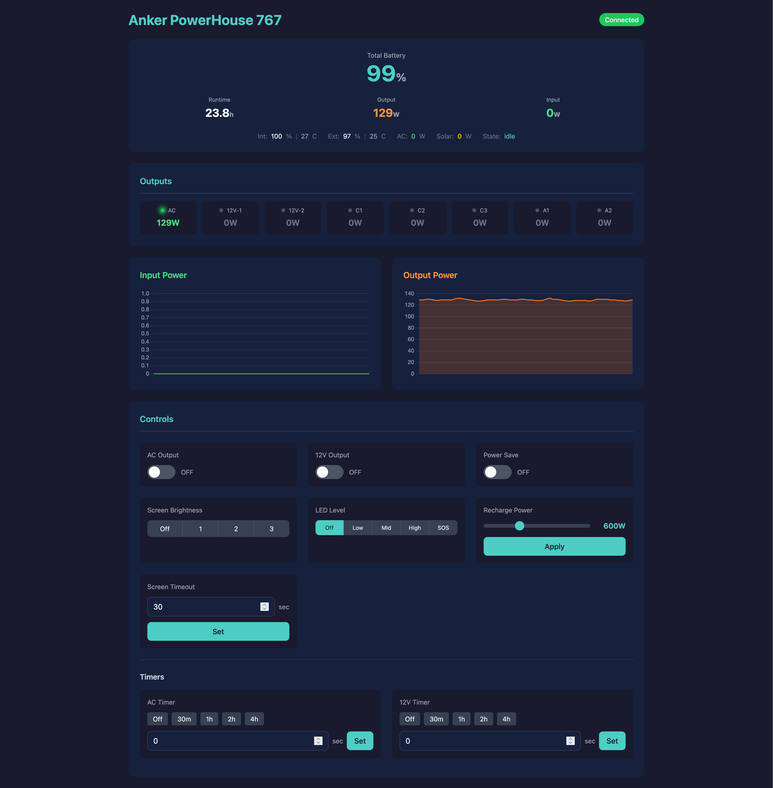

# Anker 767 BLE Web Server

A REST API and Web server for controlling and monitoring your Anker PowerHouse 767 (F2000) power station via Bluetooth.

Monitor battery status, toggle outlets, adjust settings — all from your browser or scripts.

## Screenshot



## Quick Start

```bash
# Run with Docker
docker run -d --name anker767 \
  --privileged \
  -p 3000:3000 \
  ctrlok/anker767-webserver:latest

# Or build locally (see Building section)
```

Server runs on `http://localhost:3000`

## API Endpoints

### Status & Telemetry

| Endpoint | Method | Description |
|----------|--------|-------------|
| `/api/status` | GET | BLE connection status |
| `/api/telemetry` | GET | Current device telemetry (battery, power, etc.) |
| `/api/device-state` | GET | Last set values for controllable parameters |

### Power Control

| Endpoint | Method | Body | Description |
|----------|--------|------|-------------|
| `/api/ac-output` | POST | `{"value": true/false}` | Toggle AC outlet |
| `/api/twelve-volt-output` | POST | `{"value": true/false}` | Toggle 12V outlet |
| `/api/power-save` | POST | `{"value": true/false}` | Toggle power save mode |

### Device Settings

| Endpoint | Method | Body | Description |
|----------|--------|------|-------------|
| `/api/screen-brightness` | POST | `{"value": 0-3}` | Screen brightness |
| `/api/led` | POST | `{"value": 0-4}` | LED level (4 = SOS) |
| `/api/recharge-power` | POST | `{"value": 200-1440}` | Recharge power in watts |

### Timers

| Endpoint | Method | Body | Description |
|----------|--------|------|-------------|
| `/api/screen-timeout` | POST | `{"value": 0-65535}` | Screen timeout (seconds) |
| `/api/ac-timer` | POST | `{"value": 0-65535}` | AC auto-off timer (seconds) |
| `/api/twelve-volt-timer` | POST | `{"value": 0-65535}` | 12V auto-off timer (seconds) |

## OpenAPI / Swagger

Interactive API docs available at:

- **Swagger UI:** http://localhost:3000/swagger-ui/
- **OpenAPI JSON:** http://localhost:3000/api-docs/openapi.json

## Metrics

Prometheus metrics exposed at `/metrics`.

Grafana dashboard available here: [https://grafana.com/grafana/dashboards/24777](https://grafana.com/grafana/dashboards/24777)

### Battery
- `anker_battery_percentage` — Total battery %
- `anker_battery_percentage_individual{battery="internal|external"}` — Per-battery %
- `anker_battery_remaining_hours` — Estimated time left
- `anker_battery_temperature{battery="internal|external"}` — Temperature (°C)
- `anker_battery_state` — 0=idle, 1=discharging, 2=charging

### Power
- `anker_total_output_watts` — Total output power
- `anker_total_input_watts` — Total input power
- `anker_ac_input_watts` — AC input
- `anker_solar_input_watts` — Solar input

### Outlets
- `anker_ac_outlet_on` — AC status (0/1)
- `anker_ac_outlet_watts` — AC power draw
- `anker_twelve_volt_on{port="0|1"}` — 12V status per port
- `anker_twelve_volt_watts{port="0|1"}` — 12V power per port

### USB Ports
- `anker_usb_c_on{port="0|1|2"}` — USB-C status (3 ports)
- `anker_usb_c_watts{port="0|1|2"}` — USB-C power
- `anker_usb_a_on{port="0|1"}` — USB-A status (2 ports)
- `anker_usb_a_watts{port="0|1"}` — USB-A power

### Connection
- `anker_connected` — BLE connection status (0/1)
- `anker_commands_total{command="..."}` — Commands sent by type

## Building

Uses [Just](https://github.com/casey/just) as a command runner. Check out the `Justfile` for all available commands.

```bash
# Setup Docker buildx (needed for multi-arch builds)
just setup-buildx

# Build for ARM64 (Raspberry Pi, etc.)
just build-arm64 0.1.0

# Build for AMD64
just build-amd64 0.1.0

# Build both architectures
just build 0.1.0

# Build and push to registry
just push 0.1.0
```

### Local Development

```bash
# Make sure you have Rust nightly
rustup default nightly

# Build
cargo build --release

# Run (needs BLE access, might need sudo or proper permissions)
RUST_LOG=info cargo run --release
```

## Docker

The Docker image is based on Debian Bookworm slim. It needs `--privileged` or proper BLE permissions to access Bluetooth.

```bash
docker run -d \
  --name anker767 \
  --privileged \
  --restart unless-stopped \
  -p 3000:3000 \
  ctrlok/anker767-webserver:latest
```

## How It Works

1. Server scans for BLE device named "767_PowerHouse"
2. Connects and maintains persistent connection
3. Parses telemetry data from device notifications
4. Exposes REST API for control and monitoring
5. Auto-reconnects if connection drops

## Known Limitations

The web UI controls for LED, timeouts, and recharge power don't display the actual current values from the device — they only allow you to set new values. I haven't figured out how to read the current settings from the device yet. PRs welcome!

## Acknowledgments

Thanks to [cclaunch/anker_ble](https://gitlab.com/cclaunch/anker_ble) for the BLE parsing ideas and protocol insights.

## License

MIT
